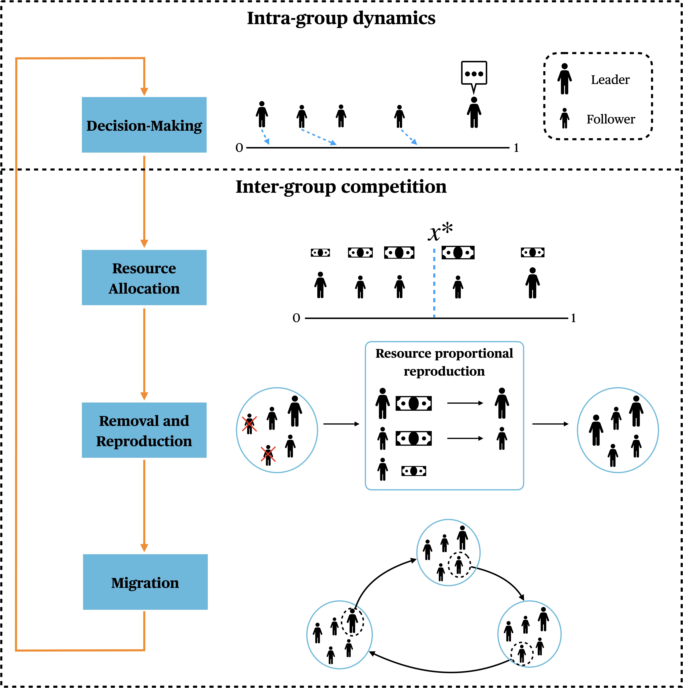
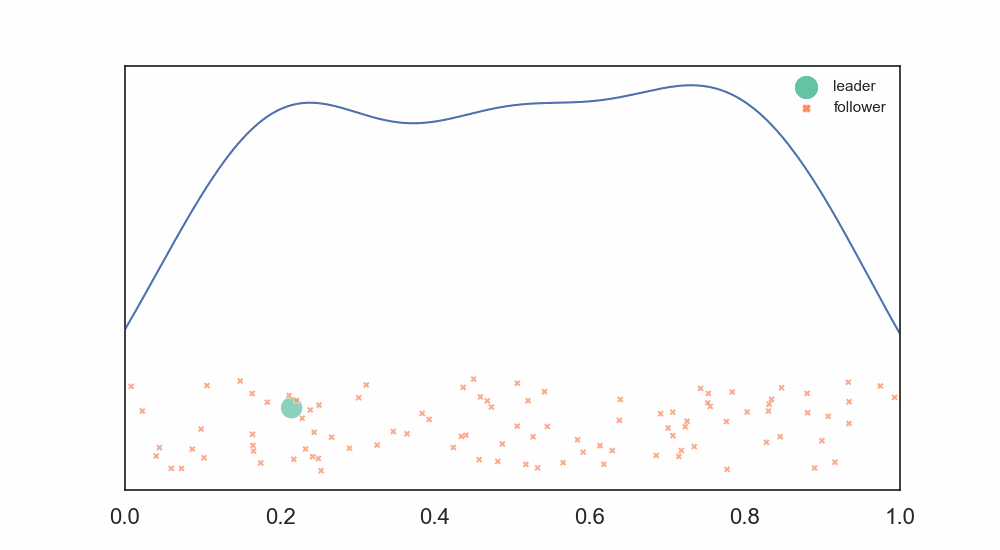

# Speed-Quality Tradeoffs Shape the Structure of Decision-Making Collectives
When should we expect groups with different social structure? Hierarchical structure is often understood to be emerging to promote efficiency in collective decision-making. However, groups can often do better by taking more time to explore a problem space or generate ideas. Our simulations of an evolutionary model of group decision-making that includes both within-group and between-group dynamics find hierarchy emerges when collective decisions need to be made quickly, but more egalitarian institutions evolve when careful deliberation is more important.

## Model Summary

The image above illustrates the overall process of the model. This model uses the framework of cultural multilevel selection, involving both intra-group deliberation and inter-group competition.

First, the model formalizes intra-group deliberation using an opinion dynamics model, which captures the process by which a group reaches a decision. Individuals in the group vary in their initial opinions as well as in their degree of influence &mdash; that is, how persuasive and stubborn they are &mdash; which shapes the time to decision as well as the decision ultimately reached. For instance, a single high-influence individual can speed up the decision-making process to a final decision near their own initial opinion, while groups where individuals have equal levels of influence will be pulled in different directions and take longer to reach a decision. We designate as leaders individuals who exert greater influence over others, while followers are individuals who are readily influenced. Individuals whose initial opinions are nearest to the decision are assumed to benefit more than those whose initial opinions were far from the final decision. The gif image belows illustrates intra-group deliberation process where there's only 1 leader and the rest are followers.

)

Second, the model formalizes inter-group competition with a group-selection process. Groups can vary in the distribution of influence among their members; one group, for instance, could consist of one influential leader and many followers, while other groups could consist of members of equal influence. After reaching a collective decision, group-level payoffs reflect the time taken by each group to reach the decision. This payoff can be either negatively correlated with decision time (representing an advantage for rapid decision) or positively correlated (representing an advantage for slow deliberation). In our evolutionary model, payoffs are translated into reproductive success, such that individuals with higher payoffs are more likely to transmit their influence trait. Since individuals in more successful groups will receive a greater payoff and thus reproduce more, the social composition of more successful groups will propagate to other groups. This group-selection process allows behaviors that are individually costly or neutral &mdash; being a follower in the case of our model &mdash; to be retained when these behaviors improve the coherence of the group.
